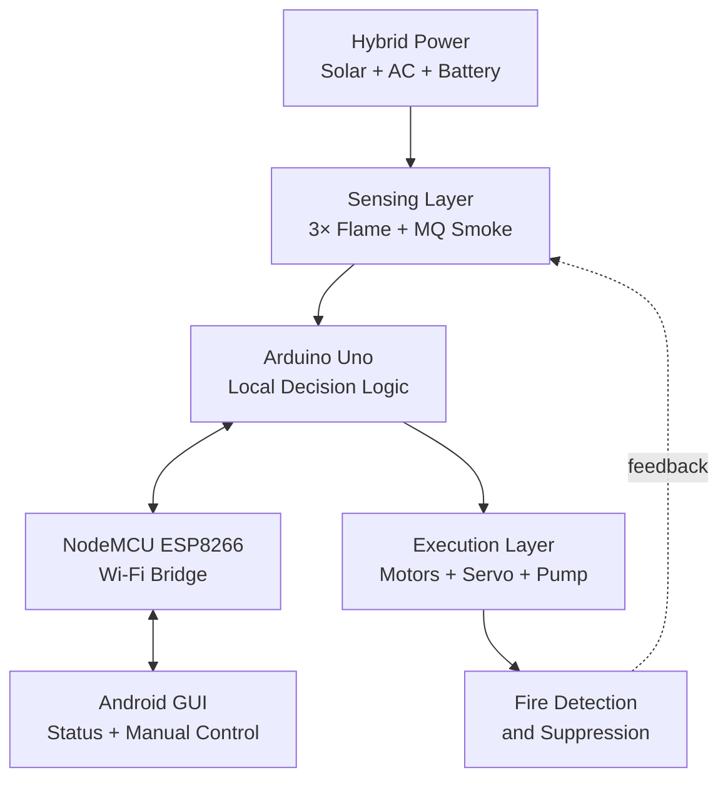

# Solar-Powered Wi-Fi Firefighting Robot


An IoT-enabled robotic prototype designed to detect, approach, and suppress small fires while reducing the need for people to enter hazardous environments. The system combines autonomous sensing, Wi-Fi monitoring, a servo-controlled water nozzle, an Android interface, and a hybrid solar–AC power system.

> [!WARNING]
> This is an academic prototype—not certified firefighting or life-safety equipment. It uses water and must **never** be used on energized electrical equipment, flammable-liquid fires, reactive metals, or any fire for which water is unsafe. Test only in a controlled environment with trained supervision and proper extinguishing equipment nearby.


## Project Description
>The Solar-Powered Wi-Fi Controlled Firefighting Robot was developed  by me as my final-year major project in Electronics and Communication Engineering (ECE) at Bhagwan Parshuram Institute of Technology (BPIT), Delhi.

## Why This Project?

Human-led firefighting can become extremely dangerous in environments affected by high temperatures, toxic smoke, unstable structures, chemicals, or explosive materials. Many low-cost firefighting robots also face practical limitations:

- Short operating range when using Bluetooth or conventional RF control
- Detection blind spots caused by a single flame sensor
- False alarms when relying on only one type of sensor
- Inefficient fixed-point water spraying
- Limited battery endurance in off-grid locations
- No convenient way to monitor or recover the robot after a mission

This project addresses these challenges through internet-based communication, multidirectional sensing, dual hazard verification, active nozzle sweeping, renewable-energy support, and manual post-operation recovery.

## Key Features

- **180° flame detection:** Three IR flame sensors—left, centre, and right—provide multidirectional coverage.
- **Dual hazard verification:** Flame readings are combined with an MQ-series smoke sensor to reduce false activation.
- **Autonomous target alignment:** The robot compares sensor signals and turns toward the strongest detected flame direction.
- **Active-sweeping suppression:** A servo motor moves the nozzle across the fire base instead of spraying a single fixed point.
- **Dual-controller architecture:** Arduino Uno manages time-critical sensing and actuation while NodeMCU handles Wi-Fi communication.
- **Remote monitoring:** An Android GUI displays states such as `Fire Detected` and `System Safe`.
- **Manual recovery mode:** Directional controls allow an operator to retrieve or reposition the robot after suppression.
- **Hybrid energy system:** A 12 V monocrystalline solar panel supports the Li-ion battery, with AC charging as backup.
- **Self-contained mobility:** The chassis carries its own water reservoir, pump, controllers, sensors, and power system.

## System Architecture



The platform follows a continuous **Sense → Analyse → Act → Report** cycle:

1. The flame array and smoke sensor monitor the environment.
2. Arduino compares the left, centre, and right sensor readings.
3. The chassis turns until the centre sensor aligns with the detected source.
4. Dual-verification logic checks the flame and smoke thresholds.
5. At the configured proximity threshold, a relay activates the water pump.
6. PWM control drives the servo through a sweeping motion.
7. NodeMCU sends live status information to the Android application.
8. Once the hazard is neutralized, the operator can recover the robot manually.

## Technology Stack

| Layer | Technology | Responsibility |
|---|---|---|
| Local controller | Arduino Uno | Sensor processing, navigation logic, relay control, and PWM generation |
| IoT controller | NodeMCU ESP8266 | Wi-Fi connectivity, status transmission, and remote-command reception |
| Firmware | Embedded C/C++ | Threshold logic, sensor fusion, movement, and suppression control |
| Development | Arduino IDE | Firmware development, compilation, and board programming |
| Sensing | 3× IR flame sensors + MQ-series smoke sensor | Directional flame detection and secondary hazard verification |
| Mobility | L298N motor driver + DC motors | Chassis direction and movement |
| Suppression | Relay, submersible pump, servo, nozzle, reservoir | Water delivery and active sweeping |
| Communication | Serial + Wi-Fi | Arduino–NodeMCU synchronization and remote data exchange |
| Interface | Android GUI | Live status display, manual movement, and recovery controls |
| Power | 12 V solar panel + AC charger + Li-ion battery | Renewable charging, backup charging, and onboard energy storage |

## Hardware Requirements

| Component | Qty. | Purpose |
|---|:---:|---|
| Arduino Uno | 1 | Primary real-time controller |
| NodeMCU ESP8266 | 1 | Wi-Fi/IoT communication bridge |
| IR flame sensors | 3 | Left, centre, and right flame detection |
| MQ-series smoke sensor | 1 | Smoke/gas-based hazard verification |
| L298N motor driver | 1 | DC motor control |
| DC geared motors | 2+ | Robotic mobility |
| Servo motor | 1 | Nozzle alignment and sweeping |
| Submersible water pump | 1 | Water delivery |
| Relay module | 1 | Pump switching |
| Water reservoir, hose, and nozzle | 1 set | Onboard extinguishing system |
| 12 V monocrystalline solar panel | 1 | Renewable energy harvesting |
| Li-ion battery bank and charger | 1 set | Energy storage and charging |
| AC-to-DC charging circuit | 1 | Backup charging |
| Wi-Fi router or mobile hotspot | 1 | Network access |
| Robotic chassis and wheels | 1 set | Mechanical platform |

> Use a correctly rated battery-management system, fuse, charging controller, common ground, flyback protection, and suitable level shifting between 5 V Arduino logic and the 3.3 V ESP8266. Keep water plumbing physically isolated from electronics.

## Software Requirements

- Arduino IDE
- Arduino Uno board support
- ESP8266 board package
- Embedded C/C++ firmware
- Android GUI/application
- USB drivers for the selected development boards
- Required libraries for servo control, Wi-Fi communication, and the chosen application protocol

## Getting Started

The report defines the system architecture but does not specify a final repository layout, pin map, communication endpoint, sensor thresholds, or complete source code. Add those verified project values before treating the steps below as deployable instructions.

### 1. Assemble and Test Each Module

Test the Arduino, NodeMCU, three flame sensors, smoke sensor, servo, motor driver, relay, pump, and motors separately. Confirm the power requirements of each module before combining them.

### 2. Mount the Sensing Array

Position the three flame sensors at left, centre, and right angles to create the intended 180° field of view. Calibrate each channel under the actual lighting conditions in which the prototype will be demonstrated.

### 3. Build the Suppression Assembly

Mount the submersible pump in the reservoir, connect it to the relay, and route the hose to the servo-mounted nozzle. Verify that no leaks can reach the battery, motor driver, microcontrollers, or wiring.


### 5. Configure Arduino–NodeMCU Communication

Define a simple, documented serial message format for:

- Sensor/status updates
- Autonomous/manual mode selection
- Forward, reverse, left, right, and stop commands
- Pump and suppression state
- Connectivity and fault status

### 6. Connect the Android GUI

Configure the application to use the same communication endpoint and command format as the NodeMCU. Verify status reporting first, then test movement commands with the chassis raised so the wheels can rotate safely.

### 7. Calibrate and Validate

Calibrate the sensing thresholds, turning response, stop distance, nozzle sweep angle, pump flow, and communication timeout. Begin with non-fire simulations before moving to any controlled flame test.

## Control Logic

```text
START
  ├─ Read left, centre, and right flame sensors
  ├─ Read smoke sensor
  ├─ Publish status to the Android GUI
  ├─ No verified hazard? Continue monitoring
  └─ Hazard verified?
       ├─ Strongest signal on left  → turn left
       ├─ Strongest signal on right → turn right
       └─ Centre aligned
            ├─ approach to configured safe distance
            ├─ stop chassis
            ├─ activate pump
            ├─ sweep nozzle using servo
            └─ stop suppression when safe condition is verified
```

The firmware should always include a default `STOP` state, communication timeout, pump timeout, low-battery handling, and a local emergency power cut-off.

## Validation Summary

The prototype report records successful functional validation of the following:

| Test Area | Reported Outcome |
|---|---|
| Target acquisition | Robot detected a flame direction and aligned the chassis toward it |
| Sensor coverage | Three-sensor array provided the intended 180° directional coverage |
| Hazard verification | Smoke sensing complemented flame detection to reduce false activation |
| Active sweeping | Servo moved the nozzle across the target area instead of spraying one point |
| Connectivity | NodeMCU exchanged status data and manual commands with the Android GUI over Wi-Fi |
| Hybrid charging | Solar charging was prioritized with AC available as backup |
| Mobility under load | Motor system moved the chassis while carrying the reservoir and power hardware |
| Recovery fail-safe | Manual GUI controls repositioned the robot after autonomous operation |

These are **prototype-level qualitative results** from simulated conditions. The report does not provide a reproducible quantitative dataset for detection distance, response time, suppression time, battery endurance, network latency, false-alarm rate, or water consumption.

## Limitations

- Remote functionality depends on a working Wi-Fi or hotspot connection.
- The water-only system is unsuitable for electrical, flammable-liquid, and other water-reactive fires.
- The current chassis is designed mainly for flat indoor surfaces.
- Reservoir size is limited by motor torque and chassis payload capacity.
- Solar charging may be slower than the combined consumption of the pump and motors.
- IR flame sensors may be affected by direct sunlight or reflective surfaces.
- Arduino Uno cannot efficiently support advanced workloads such as video processing or SLAM.
- Internet connectivity expands network reach, but it does not guarantee operation at any distance; performance depends on coverage, infrastructure, latency, and service availability.

## Future Enhancements

- ESP32-CAM or Raspberry Pi video streaming
- AI-based fire classification and object detection
- Obstacle avoidance and SLAM
- GPS waypoint navigation and return-to-base
- CO, methane, ammonia, and other toxic-gas sensing
- Tracked all-terrain chassis with improved heat protection
- Multiple extinguishing agents selected by fire class
- Battery telemetry, water-level sensing, and predictive maintenance
- Encrypted communication, authenticated commands, and secure credential storage
- Mesh networking and coordinated multi-robot suppression


## Contributing

Contributions that improve safety, documentation, firmware reliability, sensor calibration, secure communication, and reproducible testing are welcome.

1. Fork the repository.
2. Create a feature branch: `git checkout -b feature/your-improvement`
3. Commit your changes: `git commit -m "Add your improvement"`
4. Push the branch: `git push origin feature/your-improvement`
5. Open a pull request describing the hardware used and tests performed.

## License

No license was specified in the project report. Add a suitable `LICENSE` file before distributing or accepting external contributions. The MIT License is common for open-source code, but hardware documentation may require separate licensing.

## Acknowledgements

This project brings together embedded systems, robotics, renewable energy, IoT communication, Android application development, and fire-safety research to explore safer first-response technologies.

---

If this project helps your work, consider starring the repository and sharing your improvements.
